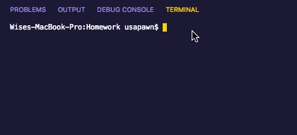
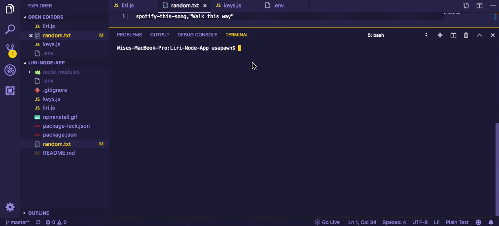

# LIRI Bot Node App
LIRI is like iPhone's SIRI. However, while SIRI is a Speech Interpretation and Recognition Interface, LIRI is a Language Interpretation and Recognition Interface. LIRI is a command line node app that takes in parameters and gives you back data.

### How To Run LIRI Bot

Instructions:
1. Clone down the repository
2. Navigate to the root of your project and run `npm install` to install all of the required node modules.



3. Run the command `node liri.js` with one of the following commands below.
    * `concert-this`
    * `spotify-this-song`
    * `movie-this`
    * `do-what-it-says`
    
### Detailed Instructions For Each Command
Option 1: `node liri.js concert-this <insert artist/band name here>`


* This will search the Bands in Town Artist Events API for an artist/band 
and render the following information about each event to the terminal/bash window:
    
    ```
    - Name of the venue
    - Venue Location
    - Date of the Event
    ```
    
Option 2: `node liri.js spotify-this-song <insert song name here>`

* Note that this feature will only work if your provide LIRI with a Spotify Client ID and Secret in the `keys.js` file.
* This command will search the Spotify API and render the following information about the song to the terminal/bash             window:
    
    ```
    - Artist(s)
    - The song's name
    - A preview link of the song from Spotify if available
    - The album that the song is from
    
    If no song is provided then the program will default to "The Sign" by Ace of Base.
    ```
    
Option 3: `node liri.js movie-this <movie name here>`

* This command will use the OMDB API and render the following movie information to the terminal/bash window:
    
    ```
    - Title of the movie.
    - Year the movie came out.
    - IMDB Rating of the movie.
    - Rotten Tomatoes score of the movie.
    - Country where the movie was produced.
    - Language of the movie.
    - Plot of the movie.
    - Actors in the movie.
    
    If no movie is provided then the program will default to "Mr. Nobody".
    ```
Option 4: `node liri.js do-what-it-says`

* Using the `fs` node package, LIRI will output the command in the `random.txt` file.
* By default, it will run `movie-this` for the movie "Inception"
* You can edit the text in the `random.txt` file to test out the other commands as well.

### Built With
* Node.js
* JavaScript
* Node Package Manager (npm)
* Various API's

### API's Used
* [Moment](http://momentjs.com/) - A JavaScript date library for formating time. :clock130:
* [Node-Spotify-API](https://www.npmjs.com/package/node-spotify-api) - Spotify's REST API library to get information about a song. :musical_note:
* [OMDB](http://www.omdbapi.com/) - An API to obtain movie information. :movie_camera:
* [Bands in Town](http://www.artists.bandsintown.com/bandsintown-api) - API that displays local concerts and upcoming tours. :guitar:
* [dotenv](https://www.npmjs.com/package/dotenv) - To hide API keys :smile:
* [Axios](https://www.npmjs.com/package/axios) - Promised base HTTP client for the browser and node.js

Here's a preview of the app in super fast speed:


